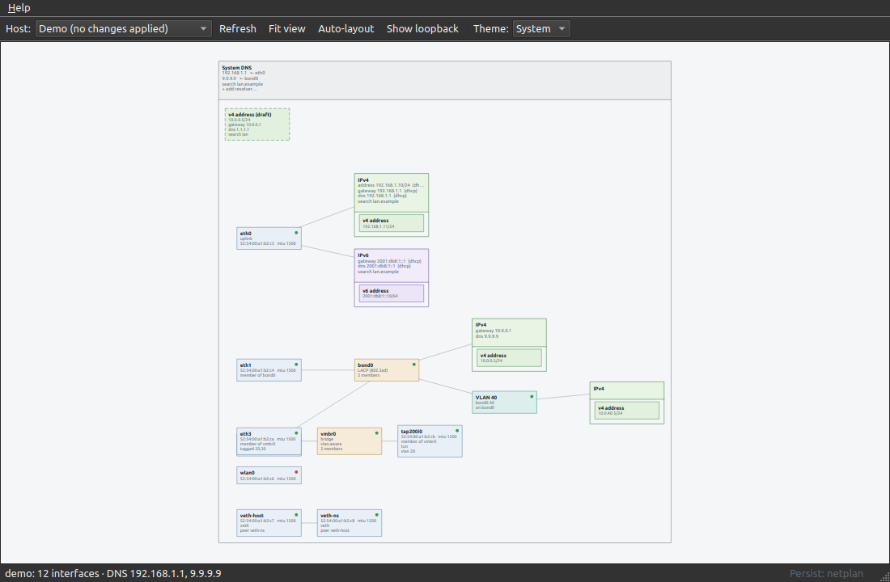
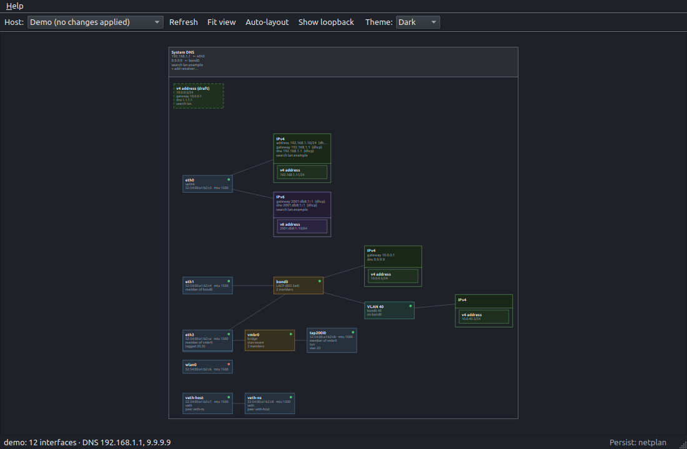

# NetGrip

**Visual, drag-and-drop network interface management for Linux.**

NetGrip shows your machine's network as it actually is: NICs are boxes, and
every piece of configuration — an IP address, a VLAN, a bond — is its own box,
joined to its interface by a line. Reconfiguring the network is direct
manipulation:

- **Drag an IP box** from one NIC to another and that address moves with it.
- **Ctrl-drag** to clone an address instead of moving it.
- **Drag one NIC onto another** to create a bond (failover, LACP, and the
  other kernel bonding modes).
- **Right-click** a NIC to add a VLAN or an IP config; right-click a bond to
  change its mode or membership.
- **Detach** an IP config and it becomes a floating *draft* you can park on
  the canvas and attach somewhere else later.
- **Right-click the canvas** to start a *draft VLAN*: give it an id, a name and
  addresses, then drag it onto a parent NIC or bond to create it for real.
- Stack them: an IP config attached to a VLAN attached to a bond of two NICs.

An interface's addresses are grouped, per protocol, into an **IPv4** or **IPv6**
box — the bucket a DHCP/RA lease fills — that carries that family's DHCP-assigned
address, gateway, DNS servers and search domains in its header. Inside sit one box
per *static* address: drag one clear of the frame to detach it to a draft, or drop
one onto a header to attach it to that interface.
**Right-click an interface → Properties** edits its MAC, MTU, alias or name;
**right-click an IPv4/IPv6 header** edits that family's addressing, gateway and DNS. Host-wide
DNS is its own **System DNS** box that shows where each resolver comes from, with
room to add your own.

It manages the local machine, or — using your existing SSH config, keys and
agent — any remote Linux machine you can reach with `ssh`.

NetGrip also runs on **Windows** as an SSH client only. There's no local Linux
stack to manage there, so the *Local* option is hidden: you pick a host from
your `~/.ssh/config` (or type `user@host`) and connect over the built-in
Windows `ssh`, authenticating with your keys/agent or a password you enter when
you select the host.



## How it works

NetGrip reads network state with `ip -json` and applies changes with plain
`iproute2` commands. Saving for persistence writes through the host's own
network backend instead. Before anything is changed, it shows you the **exact
commands** it is about to run and asks for confirmation — what you approve is
what executes, locally via `sudo`/`pkexec` or remotely via `ssh`.

Changes land on the *running* network stack first — real and immediate. When
you're happy with them, **Save** persists them across reboots through whatever
backend owns your host's configuration (netplan, systemd-networkd,
NetworkManager or ifupdown); a status-bar indicator shows which one. A **Try**
applies a change and auto-reverts it after a countdown unless you keep it, so
you can test before committing.

The canvas stays *flat* — boxes joined by straight lines — but follows your
desktop's light or dark theme, with a toolbar **Theme** selector (System /
Light / Dark) that's remembered between runs. The same demo host in dark mode:



NetGrip also remembers, per host, where you place the boxes, the names you give
IP-config boxes, and any draft configs — restored the next time you open it.

## Installing

NetGrip is alpha software. From source:

```sh
git clone https://github.com/theyoungrossco/netgrip.git
cd netgrip
python3 -m venv .venv && .venv/bin/pip install .
.venv/bin/netgrip
```

or with [pipx](https://pipx.pypa.io/): `pipx install git+https://github.com/theyoungrossco/netgrip.git`

Requirements: Linux, Python ≥ 3.10, iproute2 ≥ 4.14 (any distro from the
last several years). Remote hosts need only `iproute2` and an SSH server.

To use NetGrip as a remote control from **Windows**, install Python ≥ 3.10 and
the built-in [OpenSSH client](https://learn.microsoft.com/windows-server/administration/openssh/openssh_install_firstuse)
(`ssh.exe`), then `pip install`. Local management is unavailable on Windows;
the *Local* option is hidden and only SSH hosts are offered. Key/agent auth via
`~/.ssh/config` is the recommended path; password login depends on the Windows
OpenSSH build honouring `SSH_ASKPASS` (it does on most current builds).

Distribution packages (apt and friends) are a stated goal — see
[docs/PACKAGING.md](docs/PACKAGING.md).

## Trying it safely

```sh
netgrip --demo
```

starts with canned interfaces. Every gesture works and shows the command
plan it *would* run, but nothing is executed. This is the best way to learn
the UI without touching your network.

## Usage

```sh
netgrip                  # manage this machine
netgrip --host user@box  # manage a remote machine over ssh
```

The **Host** dropdown lists the machine itself plus every concrete `Host`
alias found in your `~/.ssh/config` (Includes are followed). Pick one to
manage it — nothing is installed on the remote side.

### Privileges

Reading network state needs no privileges. Applying changes does:

- **Locally:** NetGrip runs as your user and escalates per action using
  passwordless `sudo` if available, otherwise `pkexec` (polkit). Running
  `sudo netgrip` also works.
- **Remotely:** the SSH user must be root or have passwordless sudo, because
  SSH runs in batch mode (no interactive password prompts).

Each user action — however many commands it expands to — is applied as a
single confirmed batch.

## Status

Working today: viewing interfaces/addresses/VLANs/bonds/bridges with their
MAC, MTU and alias; addresses grouped per protocol into IPv4/IPv6 boxes that
carry that family's gateway, DNS and search; moving and cloning IP configs
(drag between interfaces or drop into a group to attach); creating and deleting
VLANs; creating bonds by drag or dialog; bond mode and membership changes; link
up/down; editing MAC/MTU/alias and renaming interfaces; setting the per-family
default gateway (with a Dynamic/Static toggle) and per-link DNS (via
systemd-resolved); a host-wide System DNS box that reads `/etc/resolv.conf` and
shows where each resolver comes from; draft IP configs; light/dark theming;
remembered box positions, names and drafts per host; remote hosts over SSH;
demo mode. Changes apply to the running stack, then **Save** persists them
across reboots through the host's network backend (netplan,
systemd-networkd, NetworkManager or ifupdown), with **Try** to test a change
before keeping it.

See [ROADMAP.md](ROADMAP.md) for what's planned next and
[CHANGELOG.md](CHANGELOG.md) for history.

## Contributing

Contributions are very welcome — see [CONTRIBUTING.md](CONTRIBUTING.md) for
the development setup and [docs/ARCHITECTURE.md](docs/ARCHITECTURE.md) for a
tour of the code. The backend core is plain Python with no Qt dependency,
so there is plenty to do even if GUI code isn't your thing.

## License

[GPL-3.0-or-later](LICENSE).
